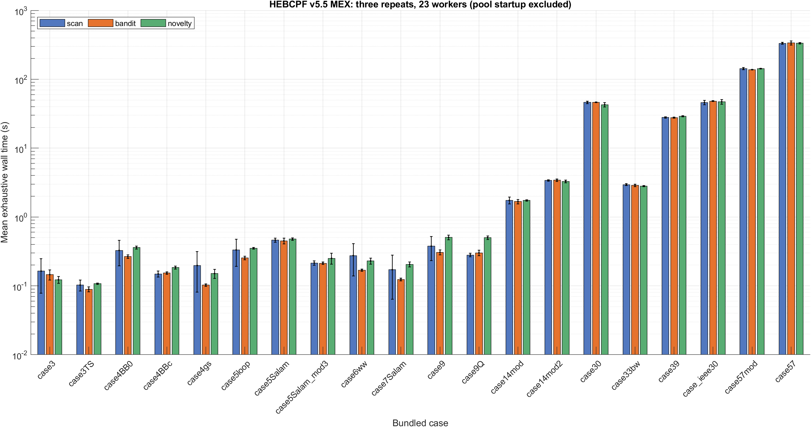
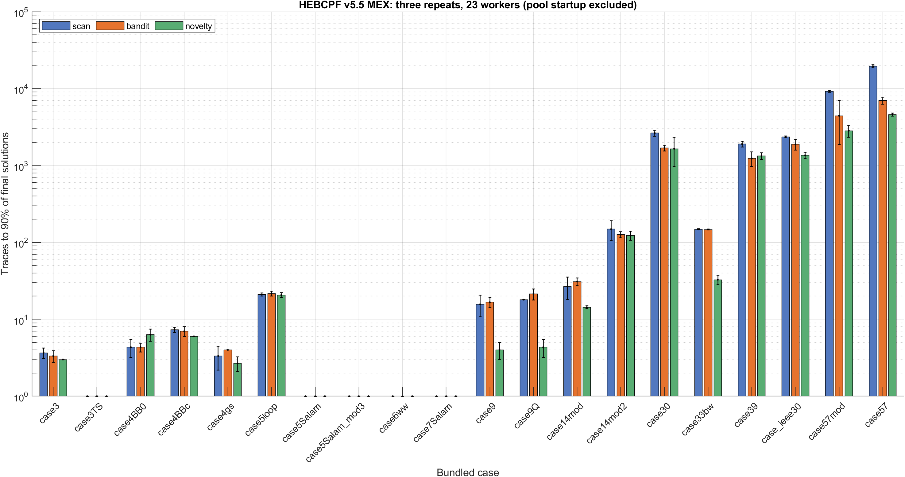
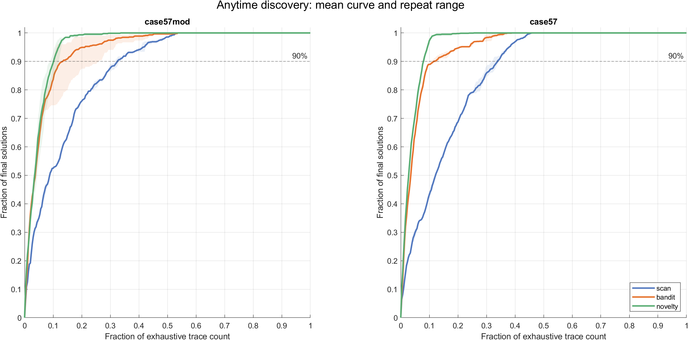
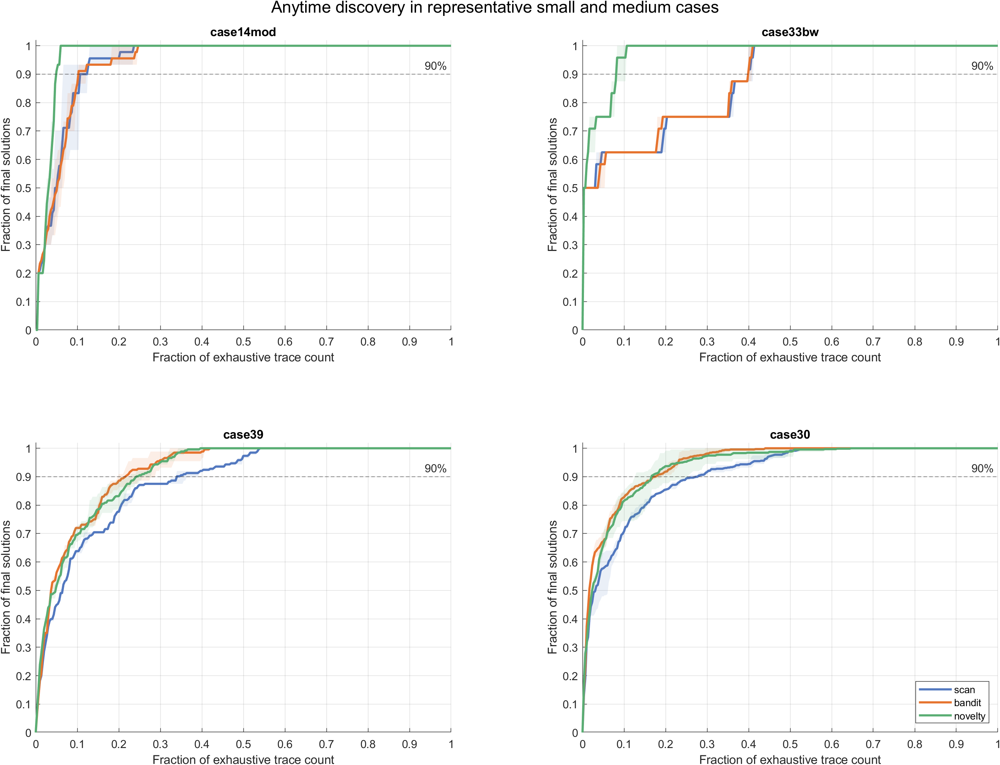
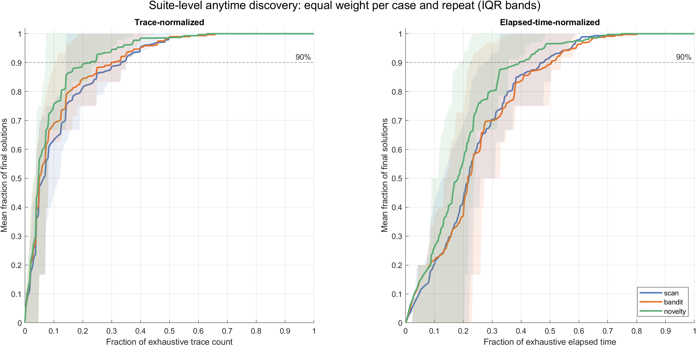

# HEBCPF v5 three-scheduler benchmark

This report compares `scan`, `bandit`, and `novelty` in the V5 MEX queue
driver. The designated-machine run used the source-equivalent unreleased V5.5
tree; the authors confirm that V5 differs only by the reproducibly rebuilt KLU
binary, so this dataset is adopted as the official V5 result. The direct public
release baseline is v4 (2026.07.15).

## Method

- 20 bundled nominal-load cases through case57.
- MATLAB R2022a, Windows x64, 23 local workers on the designated main job machine.
- Three measured repeats per scheduler and case (180/180 PASS).
- One persistent pool per case group; pool startup and three policy warm-ups excluded.
- Policy order rotated by repeat. Raw state was saved after every run.
- Separate order-independent validation: bandit and novelty each compared once with the saved scan reference for every case (40/40 PASS).

All published values in this report come only from official dataset
`20260724_3x23`; results from other machines are not merged. The portable raw
release asset is `release_assets/HEBCPF-v5-benchmark-raw.zip`, accompanied by
its SHA-256 checksum. Dataset provenance and settings are recorded in
`BENCHMARK_METADATA_v5.json`.

The benchmark-time KLU SHA-256 was
`964c153a3e3bef431c309f4072c9b69c2a10ebdb1f92cb0a98c57b21afa70999`;
the reproducibly rebuilt V5 release binary is
`e84e55c40afd1268a6ccf994df6932b184193fefee33a55bd5523a3a1fee2ff2`.
No result from the current auxiliary machine is included.

## Overall results

| Policy | Sum wall, mean +/- SD (s) | Sum traces to 90% | vs scan | Sum total traces | Selection time (% wall) | Wall wins | t90 wins | Max set distance |
|---|---:|---:|---:|---:|---:|---:|---:|---:|
| `scan` | 606.947 +/- 15.320 | 35975.3 | 1.000x | 112767.7 | 3.573 (0.59%) | 4 | 6 | 0 |
| `bandit` | 607.184 +/- 24.875 | 16611.3 | 0.462x | 112767.3 | 0.980 (0.16%) | 12 | 7 | 2.48e-10 |
| `novelty` | 606.698 +/- 7.352 | 11975.3 | 0.333x | 112767.7 | 34.163 (5.63%) | 4 | 18 | 2.66e-09 |

Across the suite, exhaustive wall time was effectively tied: bandit was 0.04% and novelty -0.04% relative to scan. The anytime result differed sharply: bandit reduced the summed traces-to-90% metric by 53.8% and novelty by 66.7%. Novelty spent 5.63% of wall time in selection versus 0.16% for bandit and 0.59% for scan.

## Per-case means

Wall entries are seconds; t90 is the first completed-trace count at 90% of that run's final solutions.

| Case | Solutions | Wall scan / bandit / novelty | t90 scan / bandit / novelty | Total traces scan / bandit / novelty |
|---|---:|---:|---:|---:|
| `case3` | 6 | 0.164 / 0.146 / 0.123 | 3.7 / 3.3 / 3.0 | 8.0 / 8.0 / 8.0 |
| `case3TS` | 6 | 0.103 / 0.089 / 0.107 | 1.0 / 1.0 / 1.0 | 7.0 / 7.0 / 7.0 |
| `case4BB0` | 14 | 0.327 / 0.265 / 0.360 | 4.3 / 4.3 / 6.3 | 21.0 / 21.0 / 22.0 |
| `case4BBc` | 12 | 0.149 / 0.153 / 0.184 | 7.3 / 7.0 / 6.0 | 20.0 / 20.0 / 20.0 |
| `case4gs` | 6 | 0.197 / 0.103 / 0.151 | 3.3 / 4.0 / 2.7 | 12.0 / 12.0 / 12.0 |
| `case5loop` | 10 | 0.332 / 0.255 / 0.353 | 21.0 / 21.7 / 20.7 | 35.0 / 35.0 / 35.0 |
| `case5Salam` | 10 | 0.462 / 0.451 / 0.478 | 1.0 / 1.0 / 1.0 | 26.0 / 26.0 / 26.0 |
| `case5Salam_mod3` | 4 | 0.215 / 0.213 / 0.251 | 1.0 / 1.0 / 1.0 | 14.0 / 14.0 / 14.0 |
| `case6ww` | 6 | 0.275 / 0.169 / 0.230 | 1.0 / 1.0 / 1.0 | 25.0 / 25.0 / 25.0 |
| `case7Salam` | 4 | 0.171 / 0.124 / 0.205 | 1.0 / 1.0 / 1.0 | 21.0 / 21.0 / 21.0 |
| `case9` | 8 | 0.377 / 0.306 / 0.506 | 15.7 / 16.7 / 4.0 | 51.0 / 51.0 / 51.0 |
| `case9Q` | 8 | 0.280 / 0.301 / 0.502 | 18.0 / 21.3 / 4.3 | 51.0 / 51.0 / 51.0 |
| `case14mod` | 30 | 1.740 / 1.675 / 1.742 | 26.7 / 31.0 / 14.3 | 287.0 / 287.0 / 287.0 |
| `case14mod2` | 68 | 3.399 / 3.423 / 3.293 | 148.7 / 126.0 / 123.3 | 641.0 / 641.0 / 641.0 |
| `case30` | 472 | 46.196 / 46.304 / 42.782 | 2637.3 / 1690.7 / 1646.3 | 9609.7 / 9606.3 / 9609.3 |
| `case33bw` | 16 | 2.947 / 2.882 / 2.815 | 148.0 / 147.0 / 32.7 | 365.3 / 365.0 / 363.3 |
| `case39` | 176 | 27.907 / 27.737 / 28.965 | 1899.3 / 1232.3 / 1327.0 | 5327.0 / 5327.0 / 5327.0 |
| `case_ieee30` | 472 | 45.909 / 48.225 / 47.107 | 2352.3 / 1880.3 / 1356.7 | 9608.0 / 9607.0 / 9608.7 |
| `case57mod` | 606 | 142.659 / 137.802 / 142.667 | 9203.3 / 4424.7 / 2829.0 | 28430.0 / 28428.0 / 28434.3 |
| `case57` | 1322 | 333.137 / 336.561 / 333.878 | 19481.3 / 6996.0 / 4594.0 | 58208.7 / 58215.0 / 58205.0 |

## Accuracy and interpretation

Every timing run returned the expected solution count. The maximum residual among the 180 measured runs was `5.78e-08`. The separate symmetric nearest-set audit matched all 40 adaptive-policy sets to their scan references; the worst distance was `2.66e-09`, below `4e-7`.

Total traces can differ slightly because asynchronous dispatch may complete work that becomes redundant after another worker reports. This is why total traces, t90, and wall time are all reported as measured outcomes.

The largest-system behavior is the clearest: on case57, mean t90 was 19,481 for scan, 6,996 for bandit, and 4,594 for novelty, while exhaustive wall times remained near 333--337 s. On case57mod, mean t90 was 9,203, 4,425, and 2,829. Thus novelty provides the strongest early discovery here, but bandit avoids most novelty-selection cost and is the default.

## Direct comparison with v4

The retained 2026.07.15 v4 MEX benchmark reported 718.656 s for one 20-case pass. The current v5 scan mean sums to 606.947 s (15.5% lower). This is a descriptive release-to-release comparison, not a controlled paired speedup: v4 has one historical pass, while v5 has three current repeats and includes other implementation changes. The scheduler conclusions above come only from the controlled v5 three-policy experiment.
